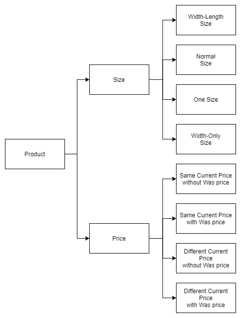

# Data Driven Test

In e-com automation framework, we are aiming to achive Data Driven Test generally. In other words, we will test same scenario with different kinds of product.

Please check which kinds of test we will test against:

There are 4 kinds of size, and 4 kinds of price. In general we may have 4 * 4 = 16 kinds of products. However consider the real practice, we will cover 4 + 4 = 8 kinds of products.

## For addresses
Use #POSTCODE, #STATE to automatically get postcode, state according to the country. Data are provided by services.country.