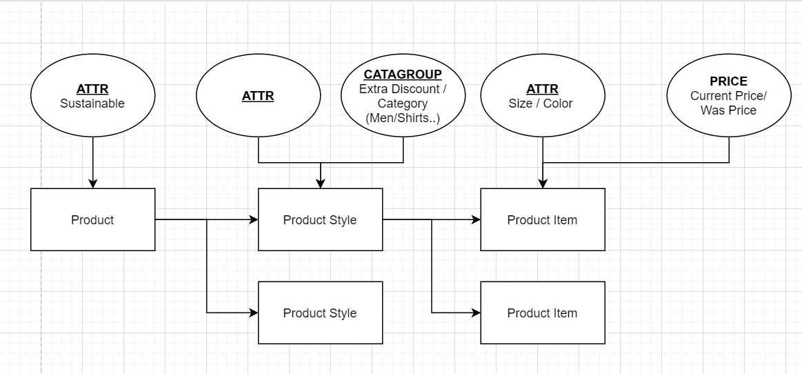
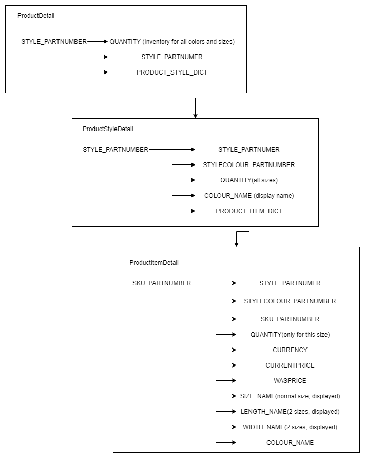

# Product Introduction

### Validation for Price
There are 3 kinds of price validation:
1. All sizes in one product style has same current price
2. All sizes in one product style has different current price
3. All sizes in one product style has same current price with Was Price
4. All sizes in one product style has different current price with Was Price

### Validation for Size
There are 3 kinds of size:
1. One Size
2. Width-Length Size (only for TH)
3. Single group Sizes

### Automation Product Detail Structure
> Product detail can only be extract for a single product, product style or product items. You can not extract detail information for a list of given part number.

### Automation Product process guide
1. Use general db prepartion step to query a list of product, product style, product item
2. From 1st step, it will return a list of Product Basic Info, which only contains ID and PARTNUMBER
3. If necessary to get detail of ONE product, use db extract step, it will extract the detail info with a given PARTNUMBER