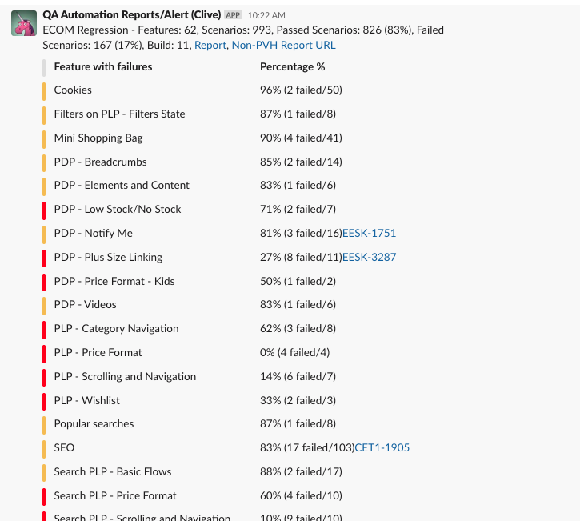

# Jenkins : Send Reports (to Slack) Pipeline

Jenkins Pipeline URL: https://10.34.14.54/view/all/job/SendReports

Jenkinsfile Link: [Jenkinsfile](../jenkins-files-unix/common/send-report-runner.jenkinsfile)

**Introduction**

This pipeline was built so that artifacts can be copied from their original build pipelines and re-sent to the chosen slack channel.

This is a short breakdown of what the pipeline does:
  1. User chooses which build pipeline he/she wants to get the artifacts from
  2. User also choose which build number he/she would like to get the artifacts from
  3. A default report prefix is already provided, however it is better to provide your own such as, for example: "CK Desktop Chrome Regression -"
  4. The slack webhook url should also be provided. A default url is provided, however the default provided is a private channel called #notifications-blackhole.
  5. After the user clicks the "Build" button, the pipeline will proceed to copy the artifacts from the said build pipeline. It will then generate the allure report, and use the information generated in the JSON. Afterwhich, it will send a curl request with the curated information to the slack webhook provided.

 

**Some things to note:**
1. The Report URL will direct to the SendReports pipeline and not to the original build pipeline. It is not possible to do it otherwise.

 

**Screenshot of what the report looks like on Slack:**

